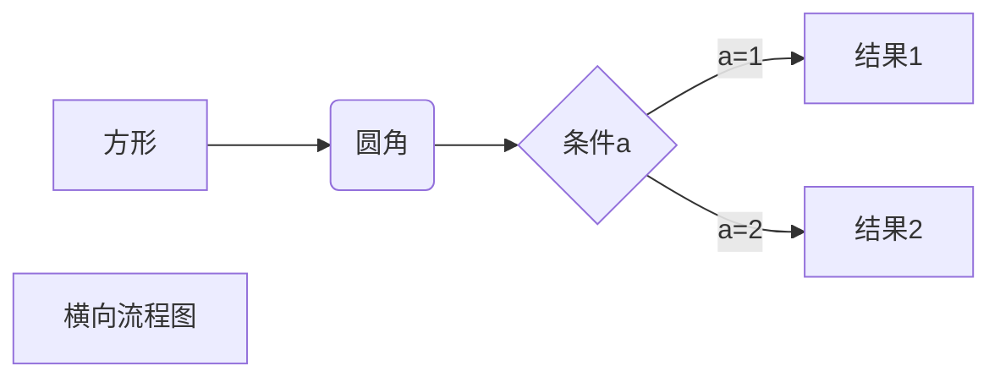
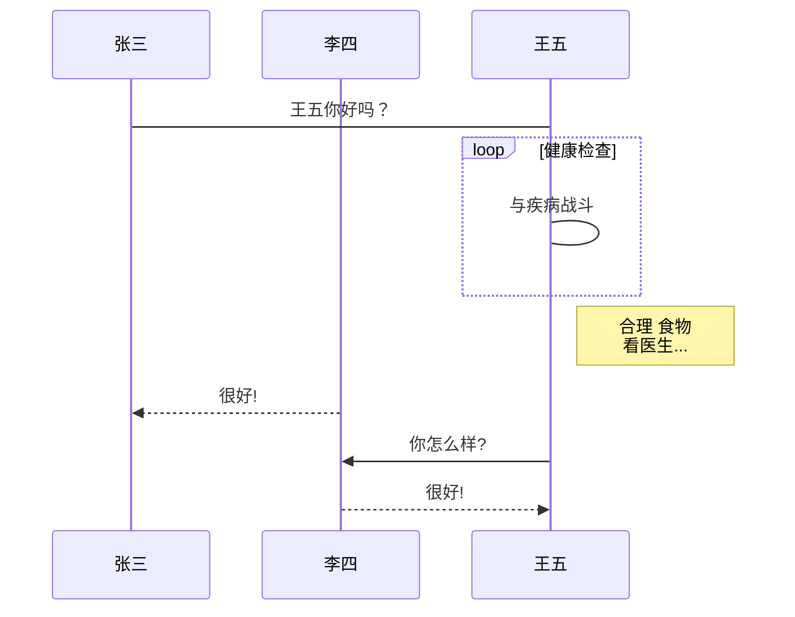
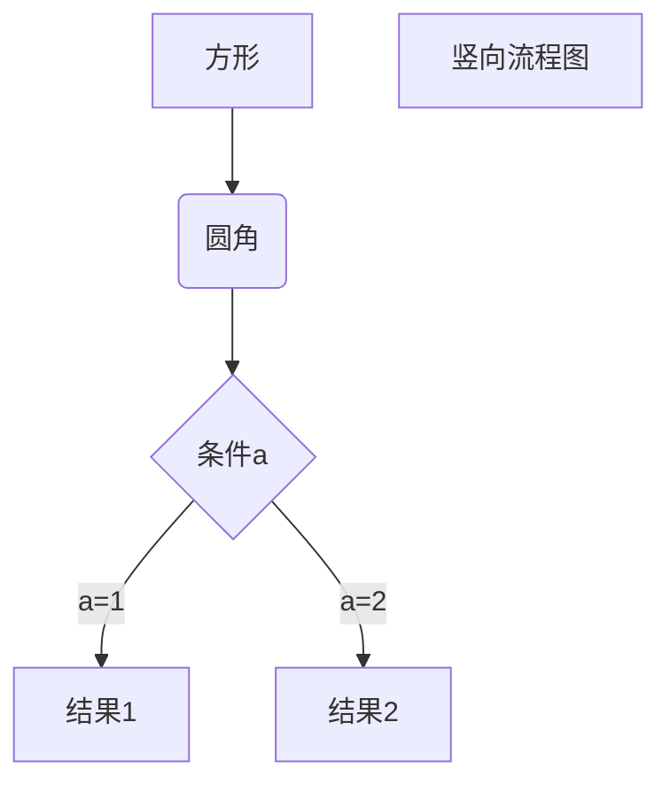

# 标题
## 标题而
### 标题三

* 第一县
* 第二
* 第三

+ 第一
+ 第二

* 第三
~~你好~~

<u>haoha<u>

好人[^Run]

[^Run] 这算一个注解
创建脚注格式类似这样 [^RUNOOB]。

[^RUNOOB]: 菜鸟教程 -- 学的不仅是技术，更是梦想！！！


1. 好
2. 你

> hao
>
> ntet
> 
> 

`test()` 函数

```php
var_dump(1);
```

这是和一个链接[百度](http://www.baidu.com)


| 表头  | 表头  |
|-----|-----|
| di  | 好   |
| hao | d   |
| sdf | f   |










```sequence
Title: 标题：复杂使用
对象A->对象B: 对象B你好吗?（请求）
Note right of 对象B: 对象B的描述
Note left of 对象A: 对象A的描述(提示)
对象B-->对象A: 我很好(响应)
对象B->小三: 你好吗
小三-->>对象A: 对象B找我了
对象A->对象B: 你真的好吗？
Note over 小三,对象B: 我们是朋友
participant C
Note right of C: 没人陪我玩
```

```flow
st=>start: 开始框
op=>operation: 处理框
cond=>condition: 判断框(是或否?)
sub1=>subroutine: 子流程
io=>inputoutput: 输入输出框
e=>end: 结束框
st(right)->op(right)->cond
cond(yes)->io(bottom)->e
cond(no)->sub1(right)->op
```

